# ai-finance-agent

```mermaid
graph TD
    %% 전체 프로젝트 루트
    Root[AI 자산 관리 에이전트: Personal Finance OS]

    %% 1. 데이터 통합 및 인프라 (Data Foundation)
    Root --> WP1[1. 데이터 통합 및 보안]
    WP1 --> F1_1[전 금융권 API 실시간 연동 - 은행/카드/증권/보험]
    WP1 --> F1_2[가상자산 거래소 및 지갑 통합]
    WP1 --> F1_3[포인트 및 마일리지 현금화 통합]
    WP1 --> F1_4[멀티 디바이스 동기화 - 워치/카/홈]
    WP1 --> F1_5[이상 거래 감지 시스템 - FDS]
    WP1 --> F1_6[사기 의심 계좌 실시간 탐지]
    WP1 --> F1_7[신용 점수 관리 및 가이드라인]

    %% 2. AI 분석 및 인터페이스 (AI Intelligence)
    Root --> WP2[2. AI 분석 및 인터페이스]
    WP2 --> F2_1[지출 99% 자동 분류 엔진]
    WP2 --> F2_2[대화형 LLM 인터페이스 - 자연어 질의응답]
    WP2 --> F2_3[뉴스 센티먼트 분석 및 포트폴리오 영향도]
    WP2 --> F2_4[재무 건강 진단 스코어링 시스템]
    WP2 --> F2_5[현금 흐름 시각화 - 샌키 플로우차트]
    WP2 --> F2_6[미래 잔고 예측 시뮬레이션 - 3~6개월]
    WP2 --> F2_7[인플레이션 반영 실질 자산 가치 측정]

    %% 3. 지출 관리 및 행동 경제학 (Spending & Psychology)
    Root --> WP3[3. 지출 관리 및 행동 가이드]
    WP3 --> F3_1[상황별 즉각적 소비 제안 - 커피 vs 여행]
    WP3 --> F3_2[예산 초과 임박 즉각 경고 및 중단 권고]
    WP3 --> F3_3[미래 가치 변환 알림 - 최신폰 vs 은퇴자금]
    WP3 --> F3_4[주간 동기부여 메시지 - 점심값 vs 주식]
    WP3 --> F3_5[택시비 기회비용 환산 - 잠을 사기 위한 비용]
    WP3 --> F3_6[무지출 챌린지 자동 기록 및 보너스 입금]
    WP3 --> F3_7[구독 서비스 미사용 감지 및 해지 권고]
    WP3 --> F3_8[유사 그룹 소비 패턴 비교 분석]

    %% 4. 투자 및 자산 최적화 (Investment & Optimization)
    Root --> WP4[4. 투자 및 자산 최적화]
    WP4 --> F4_1[로보어드바이저 - 글로벌 자산 배분 및 리밸런싱]
    WP4 --> F4_2[비상금 자동 예치 - 파킹통장 자동 이동]
    WP4 --> F4_3[저점 매수 타이밍 알림 - 증시 과매도 감지]
    WP4 --> F4_4[배당금 통합 관리 캘린더]
    WP4 --> F4_5[투자 오답 노트 - 매도 사유 기록 및 패턴 경고]
    WP4 --> F4_6[카드 실적 계산기 및 최적 혜택 안내]

    %% 5. 자금 흐름 자동화 (Workflow Automation)
    Root --> WP5[5. 자금 흐름 자동화]
    WP5 --> F5_1[자동 이체 최적화 - 잔고 맞춤 일정 조정]
    WP5 --> F5_2[월급날 자동 쪼개기 - 생활비/저축/비상금/투자]
    WP5 --> F5_3[목표 기반 저축 서비스 - 잔돈 모으기/정액]
    WP5 --> F5_4[고정비 자동 계산 및 납부 관리]
    WP5 --> F5_5[최적 적금 예산 자동 산정]

    %% 6. 세무 및 생애 주기 (Tax & Life Planning)
    Root --> WP6[6. 세무 및 생애 주기]
    WP6 --> F6_1[절세 계좌 최적화 - ISA/IRP 납입 한도 관리]
    WP6 --> F6_2[연말정산 실시간 시뮬레이터 - 카드 비중 교정]
    WP6 --> F6_3[해외 주식 양도소득세 절세 가이드]
    WP6 --> F6_4[중소기업 취업자 소득세 감면 추적]
    WP6 --> F6_5[생애 주기별 시나리오 점검 - 결혼/출산/은퇴]
    WP6 --> F6_6[경조사비 기록 및 가이드라인]
    WP6 --> F6_7[개인 자산 로드맵 퀘스트 및 뱃지 시스템]
    WP6 --> F6_8[할부 누적 시각화 및 통합 경고]
```


```
graph TD
    Root[<b>AI 자산 관리 에이전트</b>] -- "관제" --> WP1
    Root -- "지능" --> WP2
    Root -- "코칭" --> WP3
    Root -- "최적화" --> WP4
    Root -- "자동화" --> WP5
    Root -- "플랜" --> WP6

    subgraph WP1 [1. 데이터 및 보안]
        direction TB
        F1_1[금융 API 실시간 연동]
        F1_2[가상자산/지갑 통합]
        F1_3[포인트 현금화 통합]
        F1_4[멀티 디바이스 동기화]
        F1_5[이상 거래 감지 FDS]
        F1_6[사기 의심 계좌 탐지]
        F1_7[신용 점수 가이드]
    end

    subgraph WP2 [2. AI 분석/인터페이스]
        direction TB
        F2_1[지출 99% 분류 엔진]
        F2_2[대화형 LLM 인터페이스]
        F2_3[뉴스 센티먼트 분석]
        F2_4[재무 건강 스코어링]
        F2_5[현금 흐름 시각화]
        F2_6[미래 잔고 예측]
        F2_7[실질 자산 가치 측정]
    end

    subgraph WP3 [3. 지출/행동 가이드]
        direction TB
        F3_1[상황별 소비 제안]
        F3_2[예산 초과 경고]
        F3_3[미래 가치 변환 알림]
        F3_4[주간 동기부여 메시지]
        F3_5[택시비 기회비용 보고]
        F3_6[무지출 챌린지 기록]
        F3_7[구독 미사용 해지 권고]
        F3_8[유사 그룹 비교 분석]
    end

    subgraph WP4 [4. 투자 최적화]
        direction TB
        F4_1[로보어드바이저/리밸런싱]
        F4_2[비상금 파킹 자동 예치]
        F4_3[저점 매수 타이밍 알림]
        F4_4[배당금 통합 캘린더]
        F4_5[투자 오답 노트]
        F4_6[카드 실적 계산기]
    end

    subgraph WP5 [5. 자금 자동화]
        direction TB
        F5_1[자동 이체 일정 조정]
        F5_2[월급날 자동 쪼개기]
        F5_3[목표 기반 저축 퀘스트]
        F5_4[고정비 자동 납부 관리]
        F5_5[최적 적금 예산 산정]
    end

    subgraph WP6 [6. 세무 및 생애 주기]
        direction TB
        F6_1[절세 계좌 한도 관리]
        F6_2[연말정산 시뮬레이터]
        F6_3[해외주식 양도세 가이드]
        F6_4[소득세 감면 추적]
        F6_5[생애 주기 시나리오]
        F6_6[경조사비 가이드라인]
        F6_7[자산 로드맵 퀘스트]
        F6_8[할부 누적 통합 경고]
    end

    %% 스타일링
    style Root fill:#f9f,stroke:#333,stroke-width:4px
    style WP1 fill:#e1f5fe,stroke:#01579b
    style WP2 fill:#fff3e0,stroke:#e65100
    style WP3 fill:#f1f8e9,stroke:#33691e
```

```mindmap
  root((AI 자산 관리 OS))
    데이터/보안
      금융 API 연동
      가상자산 통합
      포인트 현금화
      멀티 디바이스
      FDS/사기탐지
      신용점수 관리
    AI 지능
      99% 지출분류
      LLM 대화형 UI
      뉴스 센티먼트
      재무 건강진단
      현금흐름 시각화
      미래잔고 예측
      인플레 반영
    행동 코칭
      소비 제안/경고
      미래가치 변환
      동기부여 알림
      택시비 환산
      무지출 챌린지
      구독 해지 권고
      유사 그룹 비교
    투자/최적화
      로보어드바이저
      비상금 자동예치
      저점매수 타이밍
      배당 캘린더
      투자 오답노트
      카드 실적 계산
    자동화
      자동이체 최적화
      월급 통장쪼개기
      목표기반 저축
      고정비 관리
    세무/플랜
      절세계좌 관리
      연말정산 시뮬
      양도세 가이드
      소득세 감면추적
      생애주기 점검
      경조사비 가이드
      자산 로드맵
      할부 누적 경고
```
